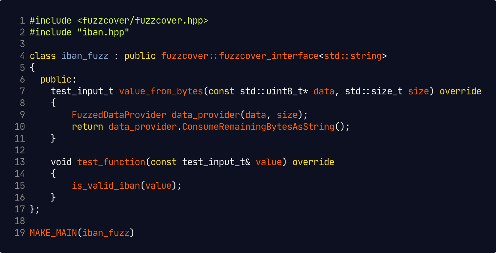

# Fuzzcover - test suite generation for C++


## About

**Fuzzcover** is a set of utilities to use [libFuzzer](http://libfuzzer.info) to generate tests to achieve a high function coverage of code of your choice. It bases on the ideas presented in the talk [**Testing Legacy Code - Fuzzing for Better Input Data**](https://meetingcpp.com/mcpp/slides/2019/Testing%20Legacy%20Code%20-%20Fuzzing%20for%20Better%20Input%20Data.pdf) by Tina Ulbrich and Niel Waldren on [Meeting C++ 2019](https://meetingcpp.com/2019/).

While the talk presents the overall framework of how fuzz testing can be used to generate test cases, **Fuzzcover** aims to automate as many steps as possible.

## Preparation

Fuzzcover relies on several tools which can be easily installed on most operating systems:

- [Clang](http://clang.llvm.org) - we rely on Clang's [source-based code coverage](https://clang.llvm.org/docs/SourceBasedCodeCoverage.html) and [libFuzzer](http://libfuzzer.info) which are both part of a Clang installation. The binaries `llvm-profdata` and `llvm-cov` must be in your path.
- [Python](https://www.python.org) - we use Python 3 and [several modules](tools/requirements.txt) for the interactive Fuzzcover suite.
- [lcov](http://ltp.sourceforge.net/coverage/lcov.php) - we use lcov to generate HTML views of your code coverage. The binary `genhtml` must be found in your path.

To use the interactive Fuzzcover suite, you need to install the dependencies via:

```shell
python3 -mvenv tools/venv
source tools/venv
pip3 install -r tools/requirements.txt
```

In the following, we assume all tools are installed and the virtual environment is sourced.

## Process

To generate tests for a function, you need to perform the following steps:

1. Implement the `fuzzcover_interface` defined in [`include/fuzzcover/fuzzcover.hpp`](https://github.com/nlohmann/fuzzcover/blob/master/include/fuzzcover/fuzzcover.hpp):
    - choose the **test input type** (e.g., `double`, `std::string`, or any other type from which you can feed the test function
    - implement function **`value_from_bytes`** which generates a test input from some bytes generated by libFuzzer
    - implement function **`test_function`** which takes a test input and executes whatever code you want to improve the test coverage for
    - call the macro `MAKE_MAIN` with the name of your class
2. Compile your code and add `libfuzzcover` as dependency using `target_link_libraries`.
3. Call the interactive tool `fuzzcover.py` with your compiled binary as parameter.
    - Choose "Start fuzzing" from the main menu and confirm the 4 parameters with return to choose the default values.
    - Wait 30 seconds until the fuzzing completes.
    - In the main menu, you can see the size of the corpus and the coverage.
    - Select "Reduce corpus" to delete unnecessary files from the corpus while preserving coverage. This may take a while.
    - Select "Dump corpus" to show all generated inputs.
    - Select "Show coverage" to open a browser showing the coverage of your code.

## Tutorial

We will explain the process in detail by looking at [iban_fuzz.cpp](examples/iban/iban_fuzz.cpp). Assume [iban.hpp](examples/iban/iban.hpp) contains code to validate International Bank Account Numbers (IBAN) in function `bool is_iban(const std::string &ibanstring)` and we want to generate tests for this function without even looking at the source code. According to the process above, we first implement the interface `fuzzcover_interface`: 



Let's walk through the lines:

- In line 1, we include the main header of Fuzzcover. The include path will be automatically adjusted once you add `libfuzzcover` as dependency to your CMake file.
- In line 2, we add the header needed to call the `is_valid_iban` function we want to test.
- In line 3, we define class `iban_fuzz` which implements the `fuzzcover_interface`. The template argument is the type of the test inputs; as function `is_valid_iban` checks `std::string`s, we use this type. Note that `test_input_t` is an alias to this type.
- In line 7, we override function `value_from_bytes`. This function is called by libFuzzer and transforms arbitrary bytes (passed as pointer and length) into a test input which in our case is a `std::string`. It is now your job to implement this conversion.
- In line 9, we use the `FuzzedDataProvider` class from [`FuzzDataProvider.h`](include/fuzzcover/FuzzedDataProvider.h) which is included by Fuzzcover. This class can generate the most relevant types very conveniently.
- In line 10, we use `ConsumeRemainingBytesAsString()` to generate a string from all input bytes. For our example, this is sufficient.
- In line 13, we override function `test_function`. This function is now the "glue code" between generate test input and the function you want to test. The return value is `void` as Fuzzcover is not interested whether the test function is executed successfully. Instead, it aims at maximizing its coverage.
- In line 15, we call the test function with the provided test input (which is `std::string` in our case).
- In line 19, we generate a `main` function that implements several command-line parameters (see the [command-line reference](#command-line-reference)). Note we pass the name of the class defined in line 4.

## Examples

Folder [`examples`](examples) contains several examples.

## Command-line reference

### Generated binaries

```
Fuzzcover - test suite generation for C++

  --fuzz [OPTION...]       perform fuzzing
  --dump CORPUS_DIRECTORY  dump the corpus files as JSON
  --test CORPUS_DIRECTORY  run the test function on the corpus files

  CORPUS_DIRECTORY  the corpus directory
  OPTION            an option for Libfuzzer (e.g., '-help=1' for more information)
```

### Interactive Fuzzcover suite

```
usage: fuzzcover.py [-h] FUZZER_BINARY [CORPUS_DIRECTORY]

Fuzzcover

positional arguments:
  FUZZER_BINARY     The binary linked to the Fuzzcover library.
  CORPUS_DIRECTORY  The directory of the corpus. If not provided, the name of
                    the corpus directory will be derived from the name of the
                    fuzzer binary. The directory will be created if it does
                    not exist.

optional arguments:
  -h, --help        show this help message and exit
```

## Roadmap

- [ ] generate an actual test suite (e.g., for [Catch](https://github.com/catchorg/Catch2) or [ApprovalTests.cpp](https://github.com/approvals/ApprovalTests.cpp)
- [ ] add CI
- [ ] add tutorial

## Support

You can **sponsor** my work at [GitHub Sponsors](https://github.com/sponsors/nlohmann).

## License

The code is licensed under the [MIT License](http://opensource.org/licenses/MIT):

Copyright © 2019-2021 [Niels Lohmann](http://nlohmann.me/)

Permission is hereby granted, free of charge, to any person obtaining a copy of this software and associated documentation files (the "Software"), to deal in the Software without restriction, including without limitation the rights to use, copy, modify, merge, publish, distribute, sublicense, and/or sell copies of the Software, and to permit persons to whom the Software is furnished to do so, subject to the following conditions:

The above copyright notice and this permission notice shall be included in all copies or substantial portions of the Software.

THE SOFTWARE IS PROVIDED "AS IS", WITHOUT WARRANTY OF ANY KIND, EXPRESS OR IMPLIED, INCLUDING BUT NOT LIMITED TO THE WARRANTIES OF MERCHANTABILITY, FITNESS FOR A PARTICULAR PURPOSE AND NONINFRINGEMENT. IN NO EVENT SHALL THE AUTHORS OR COPYRIGHT HOLDERS BE LIABLE FOR ANY CLAIM, DAMAGES OR OTHER LIABILITY, WHETHER IN AN ACTION OF CONTRACT, TORT OR OTHERWISE, ARISING FROM, OUT OF OR IN CONNECTION WITH THE SOFTWARE OR THE USE OR OTHER DEALINGS IN THE SOFTWARE.