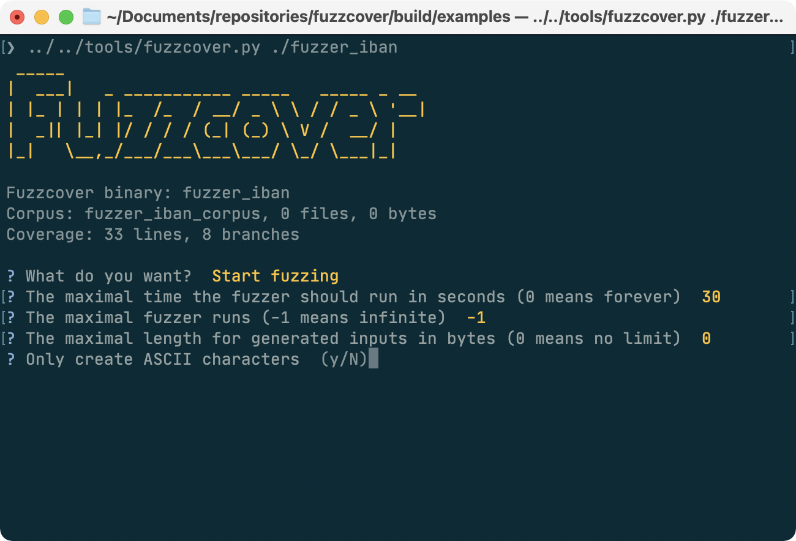
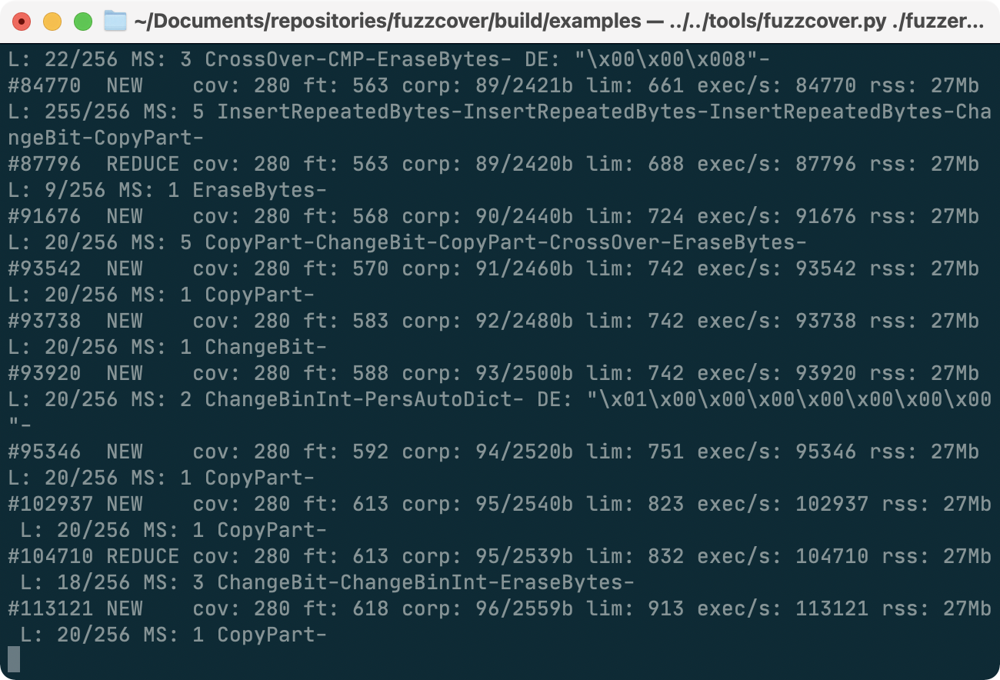
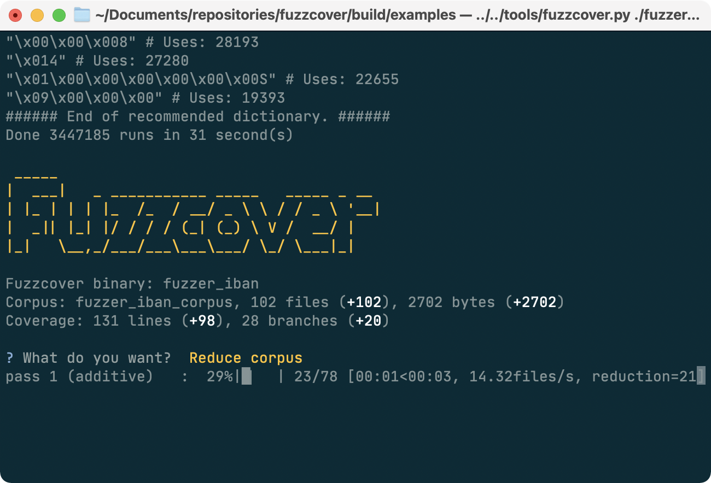
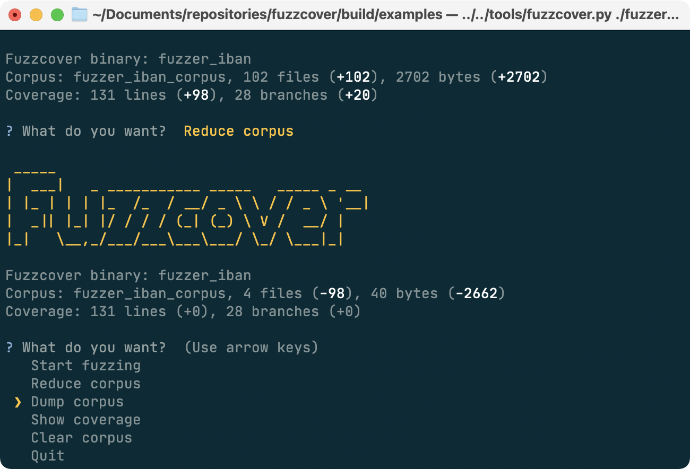
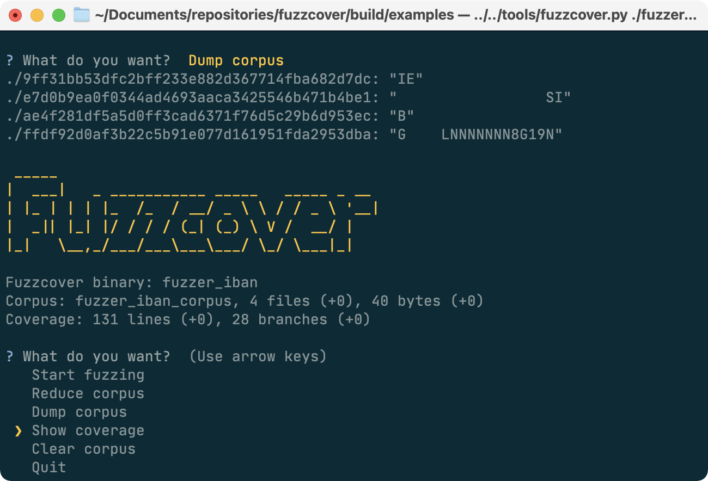

<p align="center">
[About](#about) | [Preparation](#preparation) | [Process](#process) | [Tutorial](#tutorial) | [Examples](#examples) | [Command-line reference](#command-line-reference) | [Corpus reduction](#corpus-reduction) | [Support](#support) | [License](#license)
</p>

## About

**Fuzzcover** is a set of utilities to use [libFuzzer](http://libfuzzer.info) to generate tests to achieve a high function coverage of code of your choice. It bases on the ideas presented in the talk [**Testing Legacy Code - Fuzzing for Better Input Data**](https://meetingcpp.com/mcpp/slides/2019/Testing%20Legacy%20Code%20-%20Fuzzing%20for%20Better%20Input%20Data.pdf) by Tina Ulbrich and Niel Waldren on [Meeting C++ 2019](https://meetingcpp.com/2019/).

While the talk presents the overall framework of how fuzz testing can be used to generate test cases, **Fuzzcover** aims to automate as many steps as possible.

## Preparation

Fuzzcover relies on several tools which can be easily installed on most operating systems:

- [Clang](http://clang.llvm.org) - we need Clang's [source-based code coverage](https://clang.llvm.org/docs/SourceBasedCodeCoverage.html) and [libFuzzer](http://libfuzzer.info) which are both part of a Clang installation. The binaries `llvm-profdata` and `llvm-cov` must be available in your path.
- [Python](https://www.python.org) - we use Python 3 and [several modules](tools/requirements.txt) for the interactive Fuzzcover suite.
- [lcov](http://ltp.sourceforge.net/coverage/lcov.php) - we use lcov to generate HTML views of your code coverage. The binary `genhtml` must be found in your path.

To use the interactive Fuzzcover suite, you need to install the dependencies via:

```shell
make fuzzcover_suite
source venv/bin/activate
```

In the following, we assume all tools are installed and the virtual environment is sourced.

### Notes on AppleClang

The default AppleClang provided by Xcode does not work as it does not contain libFuzzer. In that case, you will get a linker error such as

```
ld: file not found: /Applications/Xcode.app/Contents/Developer/Toolchains/XcodeDefault.xctoolchain/usr/lib/clang/12.0.5/lib/darwin/libclang_rt.fuzzer_osx.a
clang: error: linker command failed with exit code 1 (use -v to see invocation)
```

You need to install Clang via Homebrew, add it to your path, and tell CMake to use it:

```shell
brew install llvm
export PATH=$(brew --prefix llvm)/bin:$PATH
CXX=clang cmake ..
```

## Process

To generate tests for a function, you need to perform the following steps:

1. Implement the `fuzzcover_interface` defined in [`include/fuzzcover/fuzzcover.hpp`](https://github.com/nlohmann/fuzzcover/blob/master/include/fuzzcover/fuzzcover.hpp):
    - choose the **test input type** (e.g., `double`, `std::string`, or any other type from which you can feed the test function)
    - choose the **test output type** (e.g., `double`, `std::string`, or any other type the test function returns); this is optional as the return value defaults to `bool`.
    - implement function **`value_from_bytes`** which generates a test input from some bytes generated by libFuzzer
    - implement function **`test_function`** which takes a test input and executes whatever code you want to improve the test coverage for
    - call the macro **`MAKE_MAIN`** with the name of your class
2. Compile your code and add `libfuzzcover` as dependency using `target_link_libraries`.
3. Call the interactive tool `fuzzcover.py` with your compiled binary as parameter.
    - Choose "Start fuzzing" from the main menu and confirm the 4 parameters with return to choose the default values.
    - Wait 30 seconds until the fuzzing completes.
    - In the main menu, you can see the size of the corpus and the coverage.
    - Select "Reduce corpus" to delete unnecessary files from the corpus while preserving coverage. This may take a while.
    - Select "Dump corpus" to show all generated inputs.
    - Select "Show coverage" to open a browser showing the coverage of your code.
    - Select "Save corpus to JSON file" to store the test suite.
4. The test suite can now be called with `--check` from your compiled binary. It will read the generated JSON file and check if every input generates the expected output.

## Tutorial

We will explain the process in detail by looking at [iban_fuzz.cpp](examples/iban/iban_fuzz.cpp). Assume [iban.hpp](examples/iban/iban.hpp) contains code to validate [International Bank Account Numbers](https://en.wikipedia.org/wiki/International_Bank_Account_Number#Validating_the_IBAN) (IBAN) in function `bool is_iban(const std::string &ibanstring)` and we want to generate tests for this function without even looking at the source code.

### Step 1: Implement Fuzzcover interface

Following the process above, we first implement the interface `fuzzcover_interface`: 

```cpp
#include <fuzzcover/fuzzcover.hpp>
#include "iban.hpp"

class iban_fuzz : public fuzzcover::fuzzcover_interface<std::string, bool>
{
  public:
    test_input_t value_from_bytes(const std::uint8_t* data, std::size_t size) override
    {
        FuzzedDataProvider data_provider(data, size);
        return data_provider.ConsumeRemainingBytesAsString();
    }

    test_output_t test_function(const test_input_t& value) override
    {
        return is_valid_iban(value);
    }
};

MAKE_MAIN(iban_fuzz)
```

Let's walk through the code:

- In line 1, we include the main header of Fuzzcover. The include path will be automatically adjusted to find it once you add `libfuzzcover` as dependency to your CMake file.
- In line 2, we add the header needed to call the `is_valid_iban` function we want to test.
- In line 3, we define class `iban_fuzz` which implements the `fuzzcover_interface`. The template argument is the type of the test inputs; as function `is_valid_iban` checks `std::string`s, we use this type. Note that `test_input_t` is an alias to this type. The return value `bool` will be aliased to `test_output_t`.
- In line 7, we override function `value_from_bytes`. This function is called by libFuzzer and transforms arbitrary bytes (passed as pointer and length) into a test input which in our case is a `std::string`. It is now your job to implement this conversion.
- In line 9, we use the `FuzzedDataProvider` class from [`FuzzDataProvider.h`](include/fuzzcover/FuzzedDataProvider.h) which is included by Fuzzcover. This class can generate the most relevant types very conveniently.
- In line 10, we use `ConsumeRemainingBytesAsString()` to generate a string from all input bytes. For our example, this is sufficient.
- In line 13, we override function `test_function`. This function is now the "glue code" between generate test input and the function you want to test.
- In line 15, we call the test function with the provided test input (which is `std::string` in our case).
- In line 19, we generate a `main` function that implements several command-line parameters (see the [command-line reference](#command-line-reference)). Note we pass the name of the class defined in line 4.

### Step 2: Compile

The [`CMakeLists.txt`](examples/CMakeLists.txt) for this example is straightforward:

```cmake
add_executable(fuzzer_iban iban/iban_fuzz.cpp)
target_link_libraries(fuzzer_iban PRIVATE libfuzzcover)
```

- In line 1, we define the executable for the fuzzer which only needs the source file [iban_fuzz.cpp](examples/iban/iban_fuzz.cpp).
- In line 2, we list the dependencies. As the IBAN validation is a header-only library, we do not need to add a library for this, and only need to add `libfuzzcover` as dependency.

We now can compile the example:

```shell
make fuzzer_iban
```

The binary is created in `build/examples/fuzzer_iban`.

### Step 3: Call the interactive Fuzzcover suite

Assuming you created and sourced a virtual Python environment and installed the required packages, you can call the interactive suite with:

```shell
cd examples
../fuzzcover.py ./fuzzer_iban
```

This will open the main menu:


The corpus will be created in folder `fuzzer_iban_corpus` in the current directory. This folder is created automatically and currently contains no files. The coverage is determined by executing the test function with every function in the corpus. The 33 covered lines and 8 branches are just the command line parser of Fuzzcover and are not relevant to your test function.

Now, select "Start fuzzing":



Then, set some parameters:

- By default, the fuzzer is only called for 30 seconds. You can set any value where `0` means running the fuzzer indefinitely. You can always abort by pressing Ctrl+C.
- The number of fuzzer runs can also be limited. Each fuzzer run tries to generate a new input, yet only inputs that change the coverage are eventually stored in the corpus. `-1` means no limit is set.
- The input sizes can be limited with the next option. The default value `0` means no limit and libFuzzer is free to generate inputs of arbitrary length.
- Finally, you can select whether only ASCII values should be created.

Once the last option is set, the fuzzer starts and a lot of lines are shown. The format is deiscribed in detail in the [libFuzzer tutorial](https://github.com/google/fuzzing/blob/master/tutorial/libFuzzerTutorial.md).



After about 30 seconds, the fuzzing ends.


As we see, the fuzzer executed some 3 million runs and added 102 files with in total 2702 bytes to the corpus. Note your exact numbers may differ. Each corpus entry is a byte sequence that can be transformed into a test case. Running all of them covers 131 lines and 28 branches.

Next, we want to reduce the corpus as 102 test files seem to be a lot. Fuzzcover will execute some heuristics to determine which files do not contribute to the coverage. See the [Corpus redudction](#corpus-reduction) section for more information.



After some time, we see that 98 files were removed from the corpus and only 4 files with 40 bytes remain while the coverage remained at 131 lines and 28 branches.



Next, we dump the corpus:



We see four lines with a long hash as filename and a JSON representation of the test input (in our case strings). You may have expected a valid IBAN number in the corpus, but that would have been a great coincidence: Fuzzcover only aims at funding great coverage, but that does not necessarily require that the `is_iban` function will ever return `true`.

Finally, we want to examine the coverage by looking at the code. A browser window opens and we can navigate to the source of our test function, `examples/iban/iban.hpp`.


The coverage is at 100%, and indeed all lines are blue and all branches are hit!

### Step 4: Integrate the new test cases

This step is not automated. It involves taking the generated test cases and including them in the test suite you use for unit tests. TODO: document this

## Examples

Folder [`examples`](examples) contains further examples:

- IBAN - this example is explained in the [tutorial](#tutorial). The code is from [Rosetta Code](http://www.rosettacode.org/wiki/IBAN#C.2B.2B) and is licensed under the [GNU Free Documentation License 1.2](https://www.gnu.org/licenses/fdl-1.2.html).
- JSON for Modern C++ - these examples generate tests for several functions of [JSON for Modern C++](https://github.com/nlohmann/json).
- Picohash - these examples test MD5, SHA-1, ans SHA-256 implementations from [picohash](https://github.com/kazuho/picohash) which is licensed as public domain.
- Ramer-Douglas-Peucker - this example creates tests for the [Ramer-Douglas-Peucker line simplification algorithm](https://en.wikipedia.org/wiki/Ramer–Douglas–Peucker_algorithm). The code is from [Rosetta Code](http://www.rosettacode.org/wiki/Ramer-Douglas-Peucker_line_simplification#C.2B.2B) and is licensed under the [GNU Free Documentation License 1.2](https://www.gnu.org/licenses/fdl-1.2.html).
- Number names - The code is from [Rosetta Code](http://www.rosettacode.org/wiki/Number_names#C.2B.2B) and is licensed under the [GNU Free Documentation License 1.2](https://www.gnu.org/licenses/fdl-1.2.html).

## Command-line reference

### Generated binaries

```
usage: binary ARGUMENTS

Fuzzcover - test suite generation for C++

arguments:
  --help                                     show this help message and exit
  --fuzz [LIBFUZZER_OPTION...]               perform fuzzing
  --dump CORPUS_DIRECTORY [CORPUS_FILE]      dump the corpus files as JSON
  --test CORPUS_DIRECTORY                    run the test function on the corpus
  --check [CORPUS_FILE] [DOCTEST_OPTION...]  execute test suite

  CORPUS_DIRECTORY  a corpus directory
  CORPUS_FILE       a corpus file in JSON format as created by --dump
  LIBFUZZER_OPTION  an option for LibFuzzer (e.g., '-help=1')
  DOCTEST_OPTION    an option for doctest (e.g., '--help')
```

Option `--fuzz` can be followed with [any option for LibFuzzer](https://llvm.org/docs/LibFuzzer.html#options).

Option `--check` can be followed with [any option for doctest](https://github.com/onqtam/doctest/blob/master/doc/markdown/commandline.md).

### Interactive Fuzzcover suite

```
usage: fuzzcover.py [-h] [--lucky] FUZZER_BINARY [CORPUS_DIRECTORY]

Fuzzcover - test suite generation for C++

positional arguments:
  FUZZER_BINARY     The binary linked to the fuzzcover library.
  CORPUS_DIRECTORY  The directory of the corpus. If not provided, the name of
                    the corpus directory will be derived from the name of the
                    fuzzer binary. The directory will be created if it does
                    not exist.

optional arguments:
  -h, --help        show this help message and exit
  --lucky           Create a test suite without user interaction.
```

## Corpus reduction

The interactive Fuzzcover suite can reduce the size of the corpus while maintaining the coverage. This reduction consists of the following steps:

- Merging: The corpus is reduced by [LibFuzzer](https://llvm.org/docs/LibFuzzer.html)'s `-merge=1` flag.
- Additive reduction: Files are copied one by one into an empty corpus directory until the original coverage is reached. Small files are tried first. This has the opportunity to avoid large files in the corpus which may be harder to understand.
- Subtractive reduction: The coverage is checked while excluding individual files. If it remains the same, the file is removed from the corpus.
- File length reduction: Bytes are removed from the end of every corpus file until the coverage decreases.

Note the actual problem of finding the smallest corpus is NP-complete, we cannot guarantee finding the smallest corpus and the described algorithm us only a heuristics.

The algorithm is stable (calling it multiple times will not further change the corpus) and deterministic (the result for a given corpus will always be the same).

## Support

You can **sponsor** my work at [GitHub Sponsors](https://github.com/sponsors/nlohmann).

## License

The code is licensed under the [MIT License](http://opensource.org/licenses/MIT):

Copyright © 2019-2021 [Niels Lohmann](http://nlohmann.me/)

Permission is hereby granted, free of charge, to any person obtaining a copy of this software and associated documentation files (the "Software"), to deal in the Software without restriction, including without limitation the rights to use, copy, modify, merge, publish, distribute, sublicense, and/or sell copies of the Software, and to permit persons to whom the Software is furnished to do so, subject to the following conditions:

The above copyright notice and this permission notice shall be included in all copies or substantial portions of the Software.

THE SOFTWARE IS PROVIDED "AS IS", WITHOUT WARRANTY OF ANY KIND, EXPRESS OR IMPLIED, INCLUDING BUT NOT LIMITED TO THE WARRANTIES OF MERCHANTABILITY, FITNESS FOR A PARTICULAR PURPOSE AND NONINFRINGEMENT. IN NO EVENT SHALL THE AUTHORS OR COPYRIGHT HOLDERS BE LIABLE FOR ANY CLAIM, DAMAGES OR OTHER LIABILITY, WHETHER IN AN ACTION OF CONTRACT, TORT OR OTHERWISE, ARISING FROM, OUT OF OR IN CONNECTION WITH THE SOFTWARE OR THE USE OR OTHER DEALINGS IN THE SOFTWARE.

### External content

- File [FuzzedDataProvider.h](include/fuzzcover/FuzzedDataProvider.h) is part of the [LLVM Project](https://llvm.org) and licensed under the [Apache License v2.0 with LLVM Exceptions](https://llvm.org/LICENSE.txt). 
- File [doctest.h](include/doctest/doctest.h) is part of [doctest](https://github.com/onqtam/doctest) and licensed under the [MIT License](https://github.com/onqtam/doctest/blob/master/LICENSE.txt). Copyright (c) 2016-2021 Viktor Kirilov.
- See the [example](#examples) section for the licenses of the code in the [examples](examples) folder.
